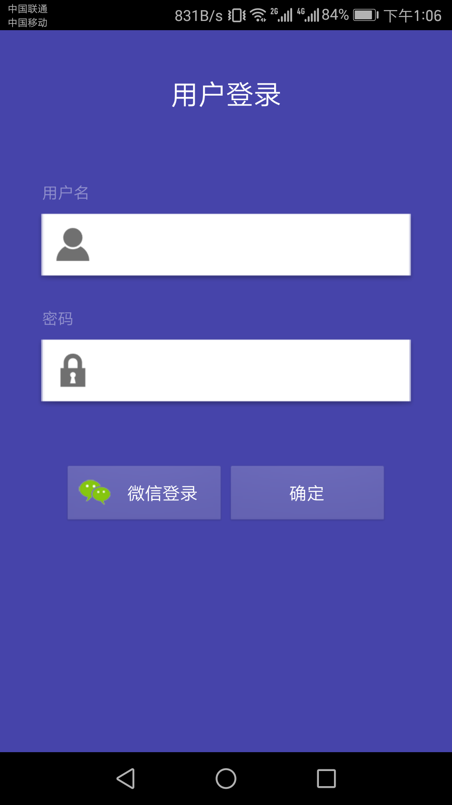
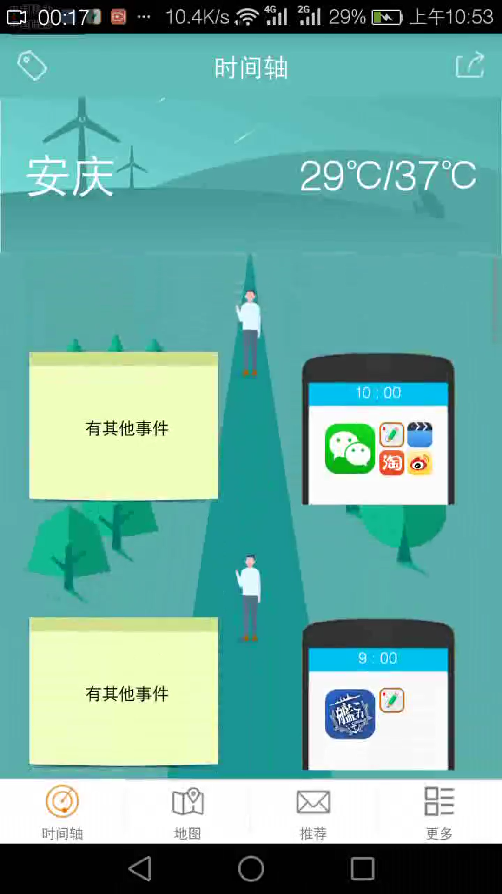
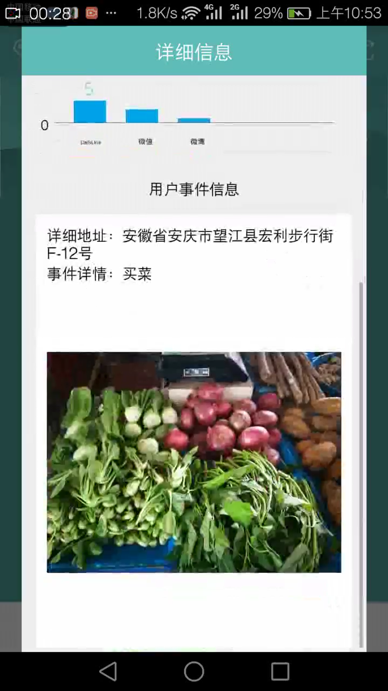
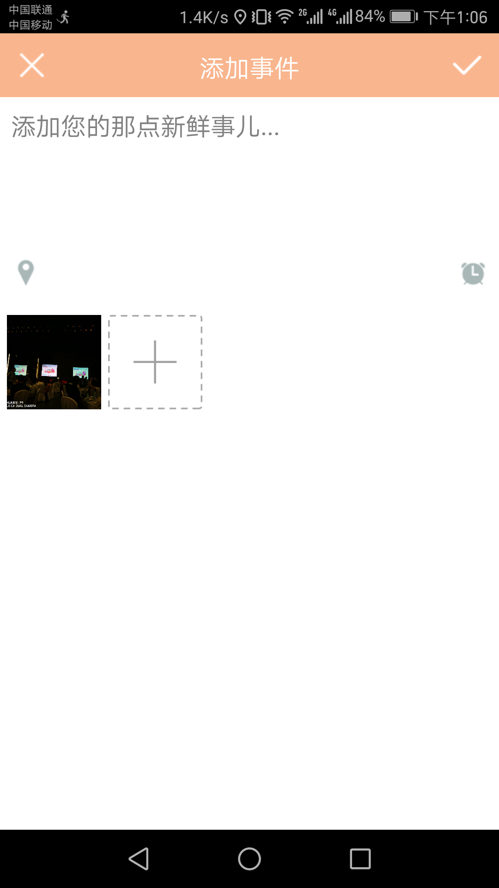
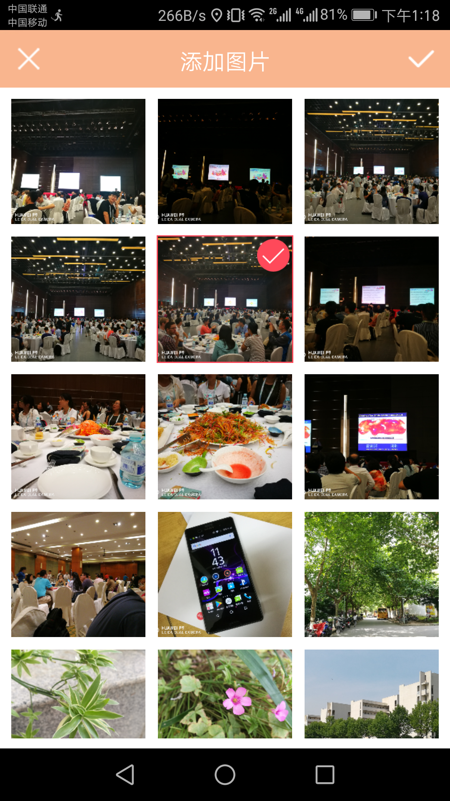
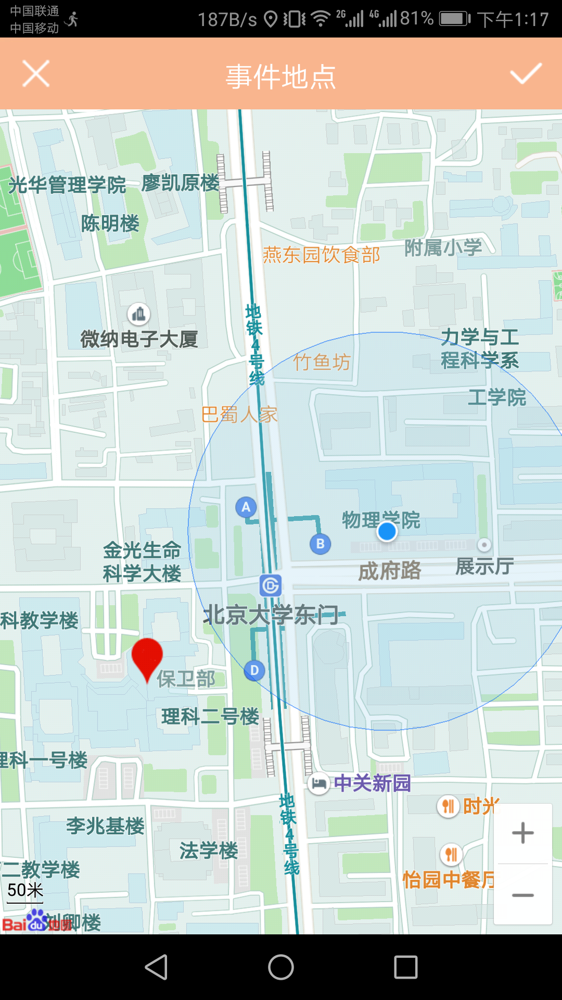
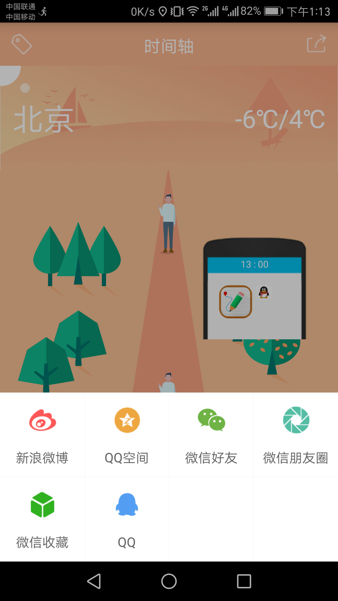
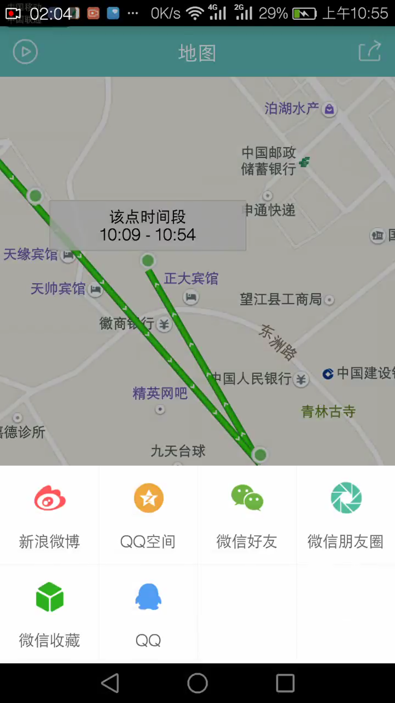
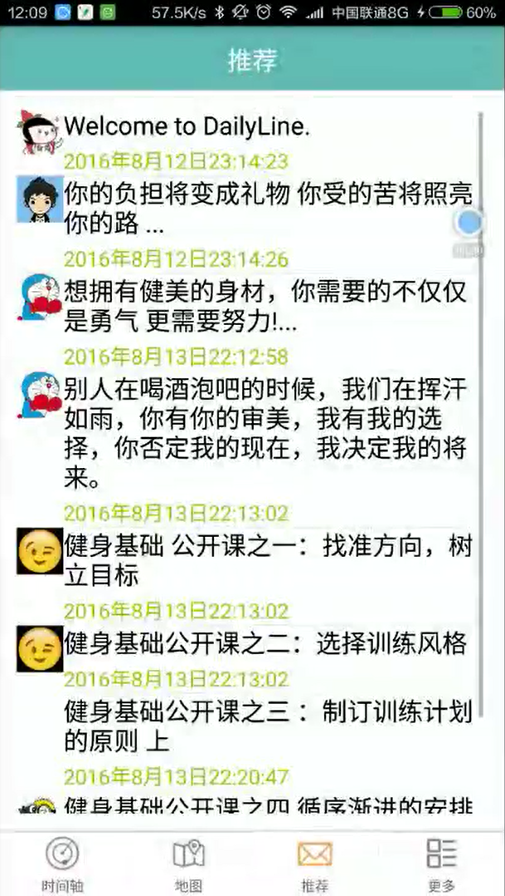

DailyLine
=========
This is an Android application of recording and using track of users, and finally show a time base and a trajectory map. Users also can add their custom event logs into their time base. 
This project inherited from TrackGIS. and this project was completed in August 2016 with a partner.

When users open this app, they need to input their account.

This is the main main page of this app.

The theme can be changed through local weather. 

`//Default is windy`
`int weaCode = wea_info.getInt("wea_code", 0);`
`if(weaCode == 1){	//Sunny`
`    headText.setBackground(getResources().getDrawable(R.drawable.skinpic_orange));`
`    listView.setBackgroundDrawable(getResources().getDrawable(R.drawable.list_back_sunny));`
`    firstIcon.setImageResource(R.drawable.head_sunny);`	
`}`
`if(weaCode == 3){	//Rainy`
`    headText.setBackground(getResources().getDrawable(R.drawable.skinpic_gray));`
`    listView.setBackgroundDrawable(getResources().getDrawable(R.drawable.list_back_rain));`
`     firstIcon.setImageResource(R.drawable.head_rain);	`
`}`
`if(weaCode == 4){	//Snow`
`  	headText.setBackground(getResources().getDrawable(R.drawable.skinpic_blue));`
`  	listView.setBackgroundDrawable(getResources().getDrawable(R.drawable.list_back_snow));`
`  	firstIcon.setImageResource(R.drawable.head_snow);`	
`}`

And the time base is shown under the textview of city and temperature. Users can click the time base to get much more infomation.

Users can add their custom event logs into the time base. Event attributes include location, time, picture and some text messages.

The time base can be shared to social networks.

The trajectory map also be shown. Click a node of trace users can learn the time of this node. The map also can be shared to social networks.

This app can push some useful information about the lifestyle of the user.

