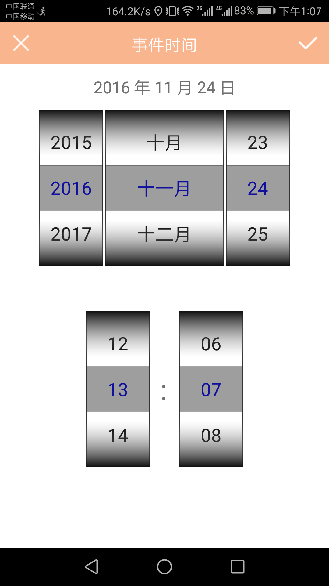

DailyLine
=========
This is an Android application of recording and using track of users, and finally show a time base and a trajectory map. Users also can add their custom event logs into their time base. 
This project inherited from TrackGIS. and this project was completed in August 2016 with a partner.

When users open this app, they need to input their account.


This is the main main page of this app.


The theme can be changed through local weather. 

```java
//Default is windy
int weaCode = wea_info.getInt("wea_code", 0);
if(weaCode == 1){	//Sunny
    headText.setBackground(getResources().getDrawable(R.drawable.skinpic_orange));
    listView.setBackgroundDrawable(getResources().getDrawable(R.drawable.list_back_sunny));
    firstIcon.setImageResource(R.drawable.head_sunny);
}
if(weaCode == 3){	//Rainy
    headText.setBackground(getResources().getDrawable(R.drawable.skinpic_gray));
    listView.setBackgroundDrawable(getResources().getDrawable(R.drawable.list_back_rain));
    firstIcon.setImageResource(R.drawable.head_rain);
}
if(weaCode == 4){	//Snow
    headText.setBackground(getResources().getDrawable(R.drawable.skinpic_blue));
    listView.setBackgroundDrawable(getResources().getDrawable(R.drawable.list_back_snow));
    firstIcon.setImageResource(R.drawable.head_snow);
}
```

And the time base is shown under the textview of city and temperature. Users can click the time base to get much more infomation.


Users can add their custom event logs into the time base. Event attributes include location, time, picture and some text messages.




The time base can be shared to social networks.


The trajectory map also be shown. Click a node of trace users can learn the time of this node. The map also can be shared to social networks.


This app can push some useful information about the lifestyle of the user.


## The method of get the track of user
### Open the database
```java
db = openOrCreateDatabase("Line_info.db", Context.MODE_PRIVATE, null);
db.execSQL("CREATE TABLE IF NOT EXISTS track" +  
"(_id INTEGER PRIMARY KEY AUTOINCREMENT, lat VARCHAR, lon VARCHAR, " +
"year INTEGER, month INTEGER, day INTEGER, hour INTEGER, minute INTEGER, second INTEGER, " +
"appname VARCHAR, step INTEGER)");
```
### Set the time span of nodes
```java
private void startTimer() {
    if (mTimer == null) {
	    mTimer = new Timer();
	}
	//Log.i(TAG, "count: " + String.valueOf(count++));
	isStop = true;
	if (mTimerTask == null) {
	    mTimerTask = new TimerTask() {
		    @Override
		    public void run() {
			    //Log.i(TAG, "count: " + String.valueOf(count++));
				do {
					try {
				    	locationClient.start();
						if (locationClient != null && locationClient.isStarted()){
							locationClient.requestLocation();
						}
						else{
							Thread.sleep(1000*60);					
						}
					} catch (InterruptedException e) {
					}
				} while (isStop);
			}
		};
	}
	if (mTimer != null && mTimerTask != null){
		mTimer.schedule(mTimerTask, delay, period);
	}
}
```

### Get the information of nodes
```java
private void getLocationInfo(BDLocation location) {
	if (location != null) {
		position = new Position();
			
		lat = location.getLatitude();
		lng = location.getLongitude();
		strLat = String.format("%.3f", lat);
		strLng = String.format("%.3f", lng);			
		position.setLat(Double.valueOf(strLat).doubleValue());
		position.setLon(Double.valueOf(strLng).doubleValue());
			
		Time time = new Time("Asia/Hong_Kong");
		time.setToNow();
			
		position.setYear(time.year);
		position.setMonth((time.month) + 1);
		position.setDay(time.monthDay);
		position.setHour(time.hour);
		position.setMinute(time.minute);
		position.setSecond(time.second);
			
		position.setApppack(getTopApp());
			
		total_step = StepDetector.CURRENT_SETP;	
		position.setStep(total_step);		
			
		PostData(position);	
	} else {
	}
}
```
(1) Get latitude and longitude (Based on BaiduLoc SDK)
```java
public class MyLocationListener implements BDLocationListener {
	public void onReceiveLocation(BDLocation location) {
		if (location == null){
			return;	
		}
		locationClient.stop();
		getLocationInfo(location);
	}
	public void onReceivePoi(BDLocation poiLocation) {			
	}
}
```
(2) Get current date and time

(3) Get the name of the APP which is running
```java
private String getTopApp() {
    String topActivity = "";
    if (Build.VERSION.SDK_INT >= Build.VERSION_CODES.LOLLIPOP) {
        UsageStatsManager m = (UsageStatsManager) getSystemService(USAGE_STATS_SERVICE);
        if (m != null) {
            long now = System.currentTimeMillis();
            List<UsageStats> stats = m.queryUsageStats(UsageStatsManager.INTERVAL_BEST, now - 60 * 1000, now);
            if ((stats != null) && (!stats.isEmpty())) {
                int j = 0;
                for (int i = 0; i < stats.size(); i++) {
                    if (stats.get(i).getLastTimeUsed() > stats.get(j).getLastTimeUsed()) {
                        j = i;
                    }
                }
                topActivity = stats.get(j).getPackageName();
            }
        }
    }
	return topActivity;    
}
```
(4) Get steps (Determine the trip mode) (Based on StepDetector.java)
```java
private void startStepDetector() {
	flag = true;
	stepDetector = new StepDetector(this);
	sensorManager = (SensorManager) this.getSystemService(SENSOR_SERVICE);
	Sensor sensor = sensorManager
			.getDefaultSensor(Sensor.TYPE_ACCELEROMETER);
	sensorManager.registerListener(stepDetector, sensor,
			SensorManager.SENSOR_DELAY_FASTEST);
}
```
